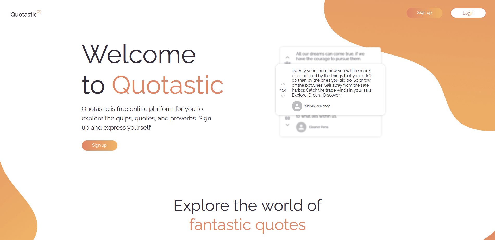
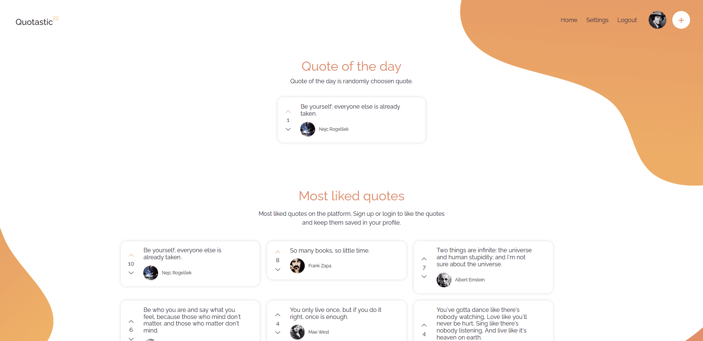
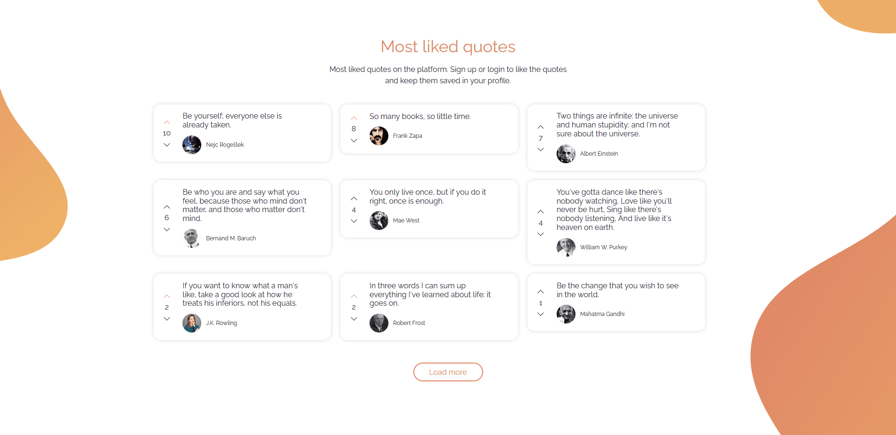
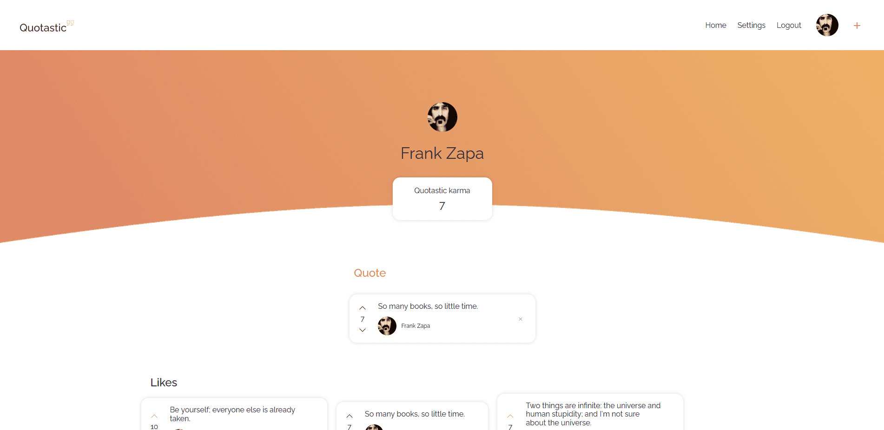
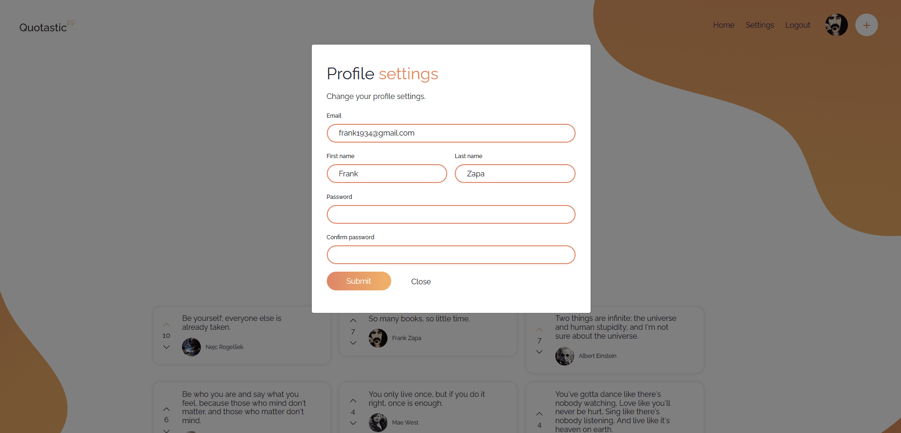
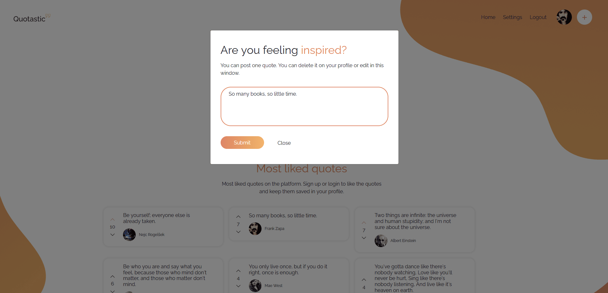
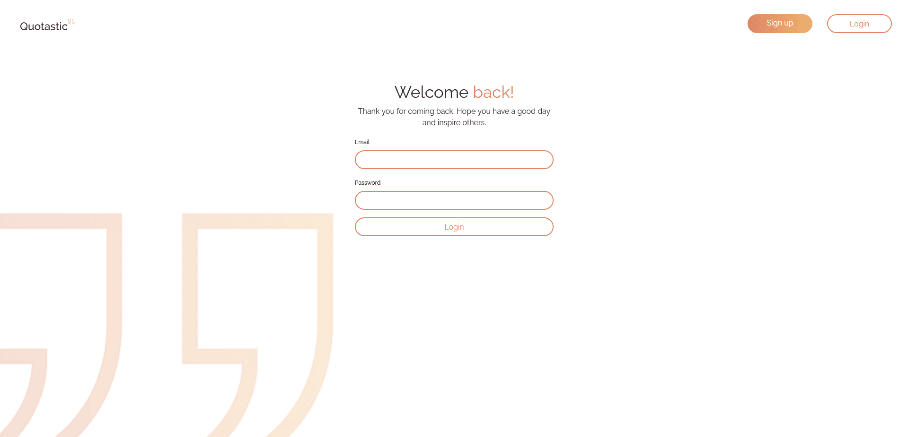
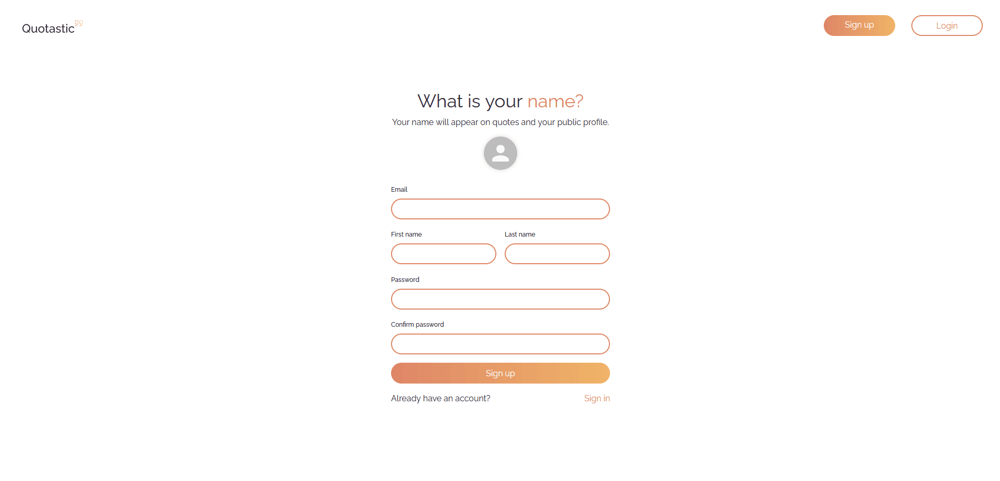

# Quotastic

Link to website (not active): https://quotastic-backend.s3.eu-north-1.amazonaws.com/index.html
---

### Table of Contents

- [Description](#description)
- [How To Use](#how-to-use)
- [References](#references)
- [License](#license)
- [Author Info](#author-info)

---

## Description

Full-stack application that will allow the user to register, write one paragraph of motivational quote, review already registered users and their quotes, and upvote or downvote a quote.

Here are some screenshots of the final app:

**Home page (User is not authenticated)**

**Home page (User is authenticated)**


**Profile page**

**Update user modal**

**Add quote modal**

**Login page**

**Register page**


#### Technologies

- HTML
- CSS
- Bootstrap
- Figma
- JavaScript
- Typescript
- Node
- NestJS
- Express
- React
- Docker
- AWS
- Git
- Github
- PostgreSQL
- TypeORM
- JWT
- Postman

[Back To The Top](#Quotastic)

---

## How To Use

Clone repository and run:

```bash
$ yarn install
```

In the project directory, you can run:

```bash
$ yarn start
```

```bash
$ yarn test
```

```bash
$ yarn build
```

## References

- SkillUp Mentor - [skillupmentor](https://skillupmentor.com/)

- LinkedIn - [@nejcrogelsek](https://www.linkedin.com/in/nejcrogelsek/)
- Github - [@nejcrogelsek](https://github.com/nejcrogelsek)
- Website - [Nejc Rogelšek](https://nejcrogelsek.si)

[Back To The Top](#Quotastic)

---

## License

MIT License

Copyright (c) 2021 [skillupmentor](https://skillupmentor.com/)

This assignment is protected with XYZ copyright. The Candidate may
upload the assignment on his closed profile on GitHub (or other
platform), but any other reproduction and distribution of the
assignment itself or the assignment’s solutions without written
permission of XYZ is prohibited.

[Back To The Top](#Quotastic)

---

## Author Info

- LinkedIn - [@nejcrogelsek](https://www.linkedin.com/in/nejcrogelsek/)
- Github - [@nejcrogelsek](https://github.com/nejcrogelsek)
- Website - [Nejc Rogelšek](https://nejcrogelsek.si)

[Back To The Top](#Quotastic)
